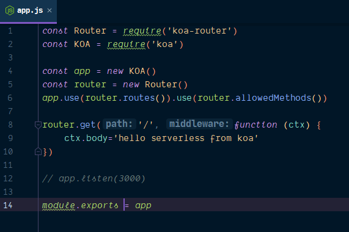
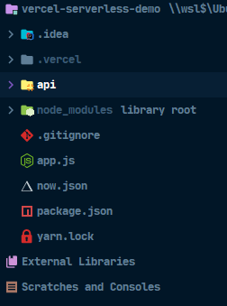
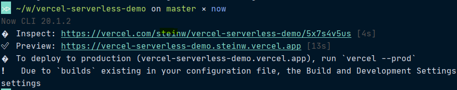
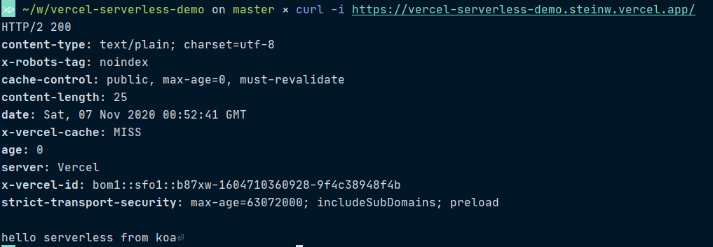

<!--more-->
## 前言

Vercel是个非常不错的部署工具，我有好几个静态网站都用它来部署，然后就在早些时候发现了它可以部署serverless，所以发文章来记录一下。

运行环境： WSL2 Ubuntu 子系统 + Idea

now 的安装很简单，运行`npm i -g now`即可。下面直接进入项目。

## Get Started

首先创建一个文件夹，然后运行`npm init -y`生成`package.json`。

```sh
mkdir vercel-serverless-demo

cd vercel-serverless-demo

npm init -y
```

## 安装依赖

我们这里使用`koa`来跑，因此需要安装koa和koa-router。

```sh
yarn add koa koa-router
```

## 创建项目相关的文件

这里只是证实一下是否可用，因此我们只需要跑个hello world证明项目能跑起来就可以了，

```sh
touch app.js
mkdir api
touch api/server.js
```

app.js 代码如下，



server.js 代码如下，

```js
const app = require('./../app')

module.exports = app
```

## 部署

在部署之前，我们需要一个部署文件，

```sh
touch now.json
```

此时的目录结构如下，



然后编辑输入配置，具体配置详情官网有，需要自己看，这里只是测试下因此随便配了下，

```json
{
  "version": 2,
  "builds": [{
    "src": "api/server.js",
    "use": "@now/node",
    "config": {
      "helpers": false
    }
  }],
  "routes": [{
    "src": "/.*",
    "dest": "/api/server.js"
  }]
}
```

输入`now`进行部署。

之后有几个互动选项，看着来填就行了。



## 检验

我们用`curl`命令来检验一下结果吧。



结果无误，因此证实完毕。
